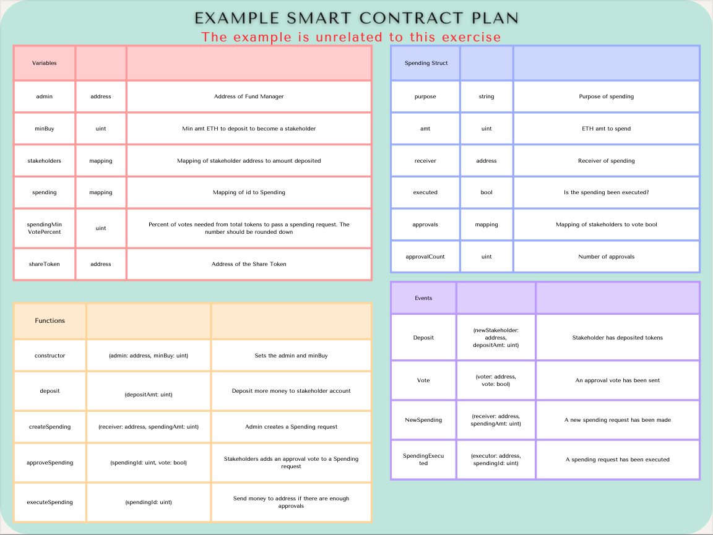
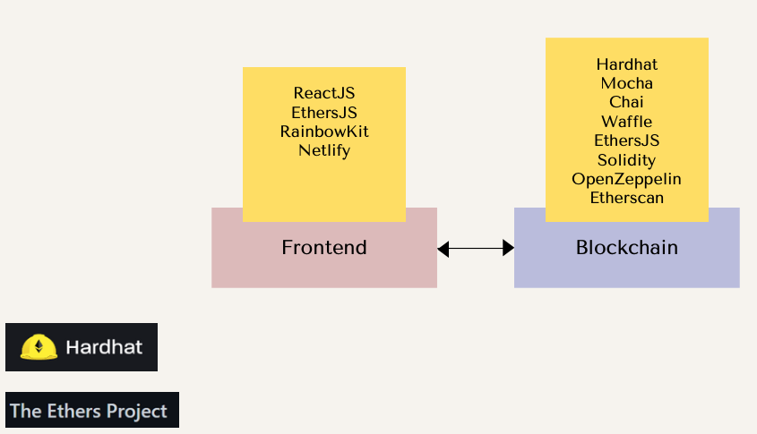

# D-Ticketmaster

The goal of this assignment is to design and implement a decentralized ticketing system using blockchain technology. The system should allow users to create events, sell tickets, and verify ownership of tickets in a decentralized manner, reducing fraud and eliminating the need for intermediaries.

## Submission Guidelines

1. Submit a GitHub repository containing:
    - Smart contract code (Solidity) + Tests (at least 95% hardhat test coverage)
    - Frontend source code
    - Deployment info (Testnet used, contract address, etc.)
    - README.md report as outlined in the documentation section
2. Provide a demo video (around 15 minutes) showcasing functionality, code, tests and test coverage walkthrough

## Project Requirements

1. Smart Contract Development (40 marks)
    - Implement marketplace smart contract in Solidity that allows event organizers to create and manage tickets, including specifying details such as name, date, time, location, description, ticket price and total ticket supply on sale.
    - The contract should enable the primary sales and secondary sales of tickets with % royalty distribution to the event organizer. All sales also include a % for platform fee sent to a treasury wallet address.
    - Each ticket should be a unique NFT (use ERC-721 standard and OpenSea Metadata and Openzeppelin Royalty standard).
    - Each ticket should also include details such as ticket ID and seat number.
2. Frontend & User Interface (30 marks)
    - Develop a simple frontend using React.js or any web framework to interact with the smart contract.
    - Users should be able to:
        - Create an event
        - Primary purchase of tickets using ERC20 called TCOIN from event organizer
        - View purchased tickets and ticket details in their wallet
        - Transfer tickets to other users
        - Sell and purchase tickets on the secondary market
        - Use MetaMask or another Web3 wallet for authentication and transactions.
3. Security & Validation (15 marks)
    - Ensure secure interactions using OpenZeppelin. Read through all of the docs and use what is needed.
    - Implement loading and error handling for failed transactions and smart contract interactions.
4. Documentation & Report (15 marks): Provide a report explaining:
    - The overall system architecture
    - Smart contract plan, logic and implementation
    - Steps to deploy and test the contract
    - Challenges faced and how they were resolved
    - Future improvements and additional features

## Roles and Actions

1. Buyer
    - Browse available tickets.
    - Purchase tickets using cryptocurrency on primary and secondary market using TCOIN.
    - View purchased tickets in their wallet.
    - View ticket details of any ticket along with the owner’s wallet address.
    - Transfer tickets to other users.
    - Verify ticket authenticity via blockchain.
2. Secondary Seller
    - List tickets on sale.
    - Set ticket prices and total supply for their own secondary sale.
    - Receive payments in cryptocurrency.
3. Event Organizer
    - Create and manage events.
    - Set ticket prices and total supply for their own primary sale. These tickets will be new NFTs minted as they are bought.
    - Edit event details: name, date, time, location, description.
    - Receive royalties of secondary sales.
4. Admin
    - Pause all Marketplace functions
    - Change secondary royalty %.
    - Change Platform fee %.
    - Change Admin address.
    - Change Treasury address.

## Criteria

1. App can handle [Metamask](https://metamask.io/) account changes, and detect if the user is on the correct network
2. The smart contracts must be developed using the Tech Stack specified in the later slides.
3. The Solidity code must be fully documented following [Natspec](https://docs.soliditylang.org/en/latest/natspec-format.html).
4. The smart contracts must be tested with written test cases with clear documentation. Make sure there are no security flaws and code is gas optimized.
5. The Smart Contracts should be deployed on a [BuildBear](BuildBear) network and code is verified. The Explorer links to the contracts should be added to the ReadMe.
6. The frontend code should be Web3 focused and is an organized UI. Take design inspiration from [Opensea](https://opensea.io/), [Uniswap](https://app.uniswap.org/swap) and [TicketMaster](https://www.ticketmaster.ca/). You don't need to copy all the functionalities, just keep the frontend simple and neat. Try to auction, sell and buy an item from Opensea testnet before you begin.
7. The website should be deployed. You can deploy on [Netlify](https://docs.netlify.com/get-started/), [Vercel](https://vercel.com/) or any other cloud provider. The URL should be in the ReadMe.
8. The code should be uploaded to the course Github in 2 folders: Frontend and SmartContracts.
9. A smart contract plan should be uploaded to the repo. Follow the format shown in the example below. **The example is unrelated to this assignment.**

. 

## Tech Stack 

Frontend:

- [ReactJS](https://reactjs.org/docs/getting-started.html): Frontend library to building Single Page Applications
- [EtherJS](https://docs.ethers.io/): JS library used for integrating with EVM
- [RainbowKit](RainbowKit: Open source library for multi-wallet integration): Open source library for multi-wallet integration
- [Netlify](https://docs.netlify.com/get-started/): Platform to host website

Blockchain: 

- [Hardhat](https://hardhat.org/hardhat-runner/docs/getting-started#overview): Framework for developing, testing and deploying Smart Contracts. Uses Mocha, Chai and Waffle
- [Mocha](https://mochajs.org/): helps document and organize tests with "describe", "it", etc
- [Chai](https://www.chaijs.com/): assertion library for testing with "expect", "assert", etc 
- [Waffle](https://getwaffle.io/): tools for compiling, deploying and testing smart contracts. It also provides extra Chai methods and can be added as an extension of Mocha
- [EthersJS](https://docs.ethers.io/): JS library used for integrating with EVM
- [Solidity](https://docs.soliditylang.org/): Language used to build smart contracts
- [OpenZeppelin Contracts](https://docs.openzeppelin.com/contracts): a library of well tested smart contracts, including ERC20 and ERC721
- [Etherscan](https://etherscan.io/): Block explorer
- [NFT Storage](https://nft.storage/) or [Pinata](Pinata): Decentralized file storage

